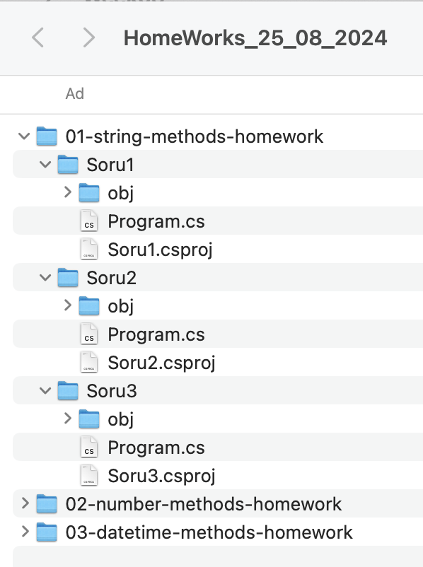

# Ödevinizi yaparken aşağıdakilere dikkat ediniz:

**1.** Öncelikle HomeWorks_25_08_2024 adında bir repo oluşturunuz.

**2.** Repo klasörünüze geçip, tüm ödevlerinizi bu klasör içinde hazırlayınız.

**3.** Toplam 5 dosya, her dosyada ise çeşitli sorular bulunmaktadır. Her dosya için bir klasör oluşturup o dosyadaki soruları o klasör içinde her soru için ayrı ayrı projeler oluşturunuz. Örnek klasör yapısını aşağıda görebilirsiniz.

# Örnek klasör yapısı

