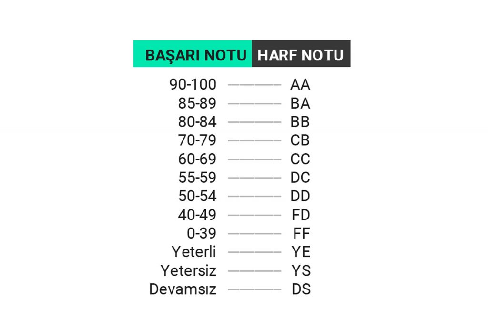

# If, if else, else if

**1.** Kullanıcıdan alınan bir sayının pozitif, negatif veya sıfır olduğunu kontrol eden bir program yazın.

**2.** Kullanıcıdan alınan üç sayıyı büyükten küçüğe sıralayan bir program yazın.

**3.** Kullanıcıdan alınan bir karakterin sesli harf olup olmadığını kontrol eden bir program yazın. (Veya (`||`) operatörünü araştırınız.)

**4.** Kullanıcıdan alınan bir yılın artık yıl olup olmadığını kontrol eden bir program yazın.

**5.** Kullanıcıdan alınan üç sayının bir üçgen oluşturup oluşturamayacağını kontrol eden bir program yazın. (Geometride üçgen teorisini araştırınız.)

**6.** Kullanıcıdan alınan bir notun aşağıdaki tabloya göre harf karşılığını veren bir program yazın.

**7.** Kullanıcıdan alınan üç sayıdan en büyüğünü bulan bir program yazın.

**8.** Kullanıcıdan alınan bir sayının 3'e ve 5'e tam bölünüp bölünmediğini kontrol eden ve uygun mesajı veren bir program yazın.

**9.** Kullanıcıdan alınan iki sayı ve bir işlem (+, -, *, /) için basit bir hesap makinesi yapın.

**10.** Kullanıcıdan alınan bir sayının asal olup olmadığını kontrol eden bir program yazın.
